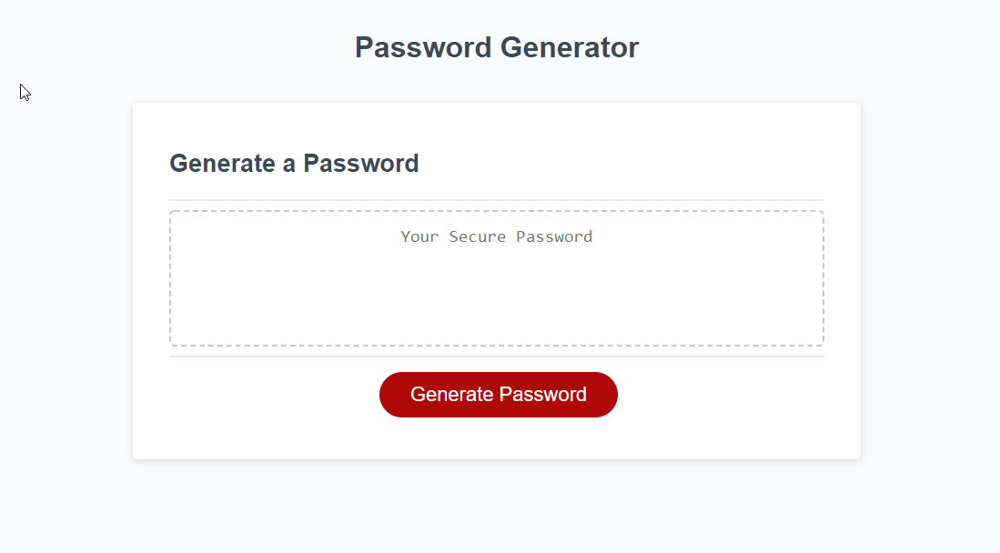

# Password-Generator

A special webpage with a single function. Designed to make a unique password tailored specifically for the user by following the prompts.

## Motovation

I was driven by my desire to hone my JavaScript knowlegdge and deepen the skillset. Alot of research went into this project and I still didnt get it exactly how I would have liked it.
Now I have my own application do generate secure passwords for the saftey of my accounts

## Challenges

Many roadblocks were hit during the span of this week. I was almost brough to tears over the weekend from spending hours staring at the code and not being able to understand what order any of it goes in. I lacked the understanding that I cannot shorted JavaScript to Java as Java is its own language and searhing Java does not bring up answers for JavaScript.
I learnt the importance of a 'Sanity Check' in getting the console to show me my progress incrementaly so I do not just blindly code before knowing if anything is working.

This week I used my first tutoring session and Byron really helped me in that he gave me the confidence I needed just by telling me that I was thinking about this the right way - then guided me through some steps to get me started from where I was stuck on the weekend. 

## Webpage

This link will take you to the webpage where you too can get your own unique password. Just click generate and follow the steps! 
Unfortunately if you want a second password you will need to refresh the page - one thing I couldnt figure out was getting the generate button to also erase the last generated code!

Link: https://virgona.github.io/Password-Generator/

